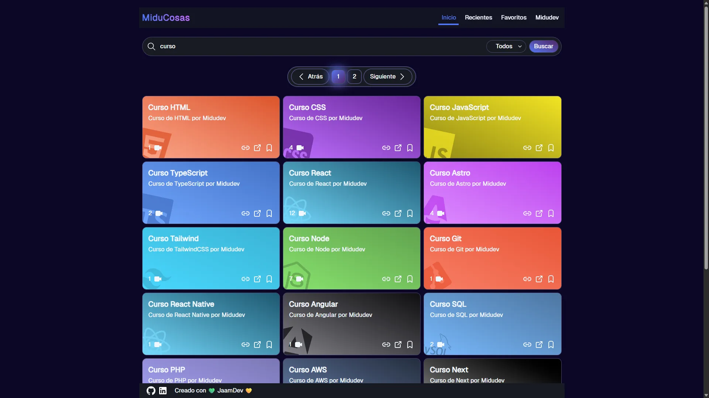

# MiduCosas

[](https://miducosas.vercel.app)
[](https://github.com/jaamdev/miducosas)

## Vista



## Tecnologías usadas para el Frontend


## Tecnologías usadas para el Backend


## Descripción

### Sitio web donde guardar todos los recursos interesantes que [Midudev](https://github.com/midudev) ha compartido en su cuenta de [X](https://x.com/midudev) o en su canal de youtube [principal](https://youtube.com/midudev) y [secundario](https://youtube.com/midulive).

## Cómo usarlo

Tan simple como usar el buscador para empezar a buscar recursos, por ejemplo:

React, TypeScript, cursos, libros, componentes, skills, bases de datos, desplegar...

Se puede guardar los recursos en favoritos para tenerlos más a mano.

## Por qué lo hice

Tenía tantos recursos interesantes guardados como marcadores en mi navegador que empecé a tener problemas para buscarlos.

Se me ocurrió hacer este proyecto para tener todo en un mismo sitio donde tener guardados los recursos interesantes que Midudev compartía en sus redes sociales, así que me puse manos a la obra y este fue el resultado.

## Documentación

Documentación o guías usadas durante el desarrollo de este proyecto.

### Vídeos

|  Nombre | Vídeo                                     |
| ------: | :-----------------------------------------|
| Midudev | [JS Camp](https://jscamp.dev)             |
|         | [Curso ReactJS](https://midu.link/react)  |

### Info

|       Nombre | Info                                                 |
| -----------: | :--------------------------------------------------- |
|  TailwindCSS | [https://tailwindcss.com](https://tailwindcss.com/)  |
|      Express | [https://expressjs.com](https://expressjs.com)       |
|      ReactJS | [https://react.dev](https://react.dev)               |
|      Valibot | [https://valibot.dev](https://valibot.dev)           |
| React Router | [https://reactrouter.com/](https://reactrouter.com/) |
|         Vite | [https://vite.dev](https://vite.dev)                 |

## Instalación

1. Clonar el repositorio

```bash
git clone https://github.com/jaamdev/miducosas.git
```

2. Instalar las dependencias

```bash
npm install
```

3. Configurar variable de entorno para la API

```
VITE_API=EXAMPLE
```

4. Iniciar servidor de desarrollo

```bash
npm run dev
```
